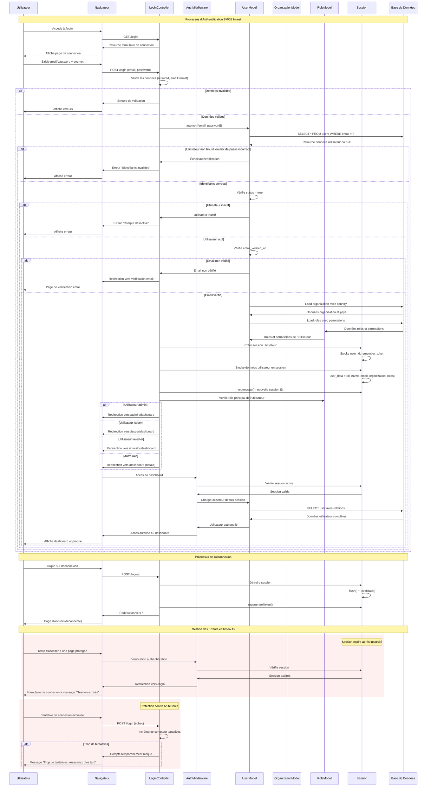

# Diagramme de Séquence - Authentification Utilisateur

## Description
Ce diagramme illustre le processus complet d'authentification d'un utilisateur dans le système BMCE Invest. Il couvre les étapes de connexion, validation des identifiants, vérification des permissions et redirection selon le rôle. Le diagramme montre également la gestion des erreurs et les différents chemins d'authentification possibles selon le statut de l'utilisateur.

