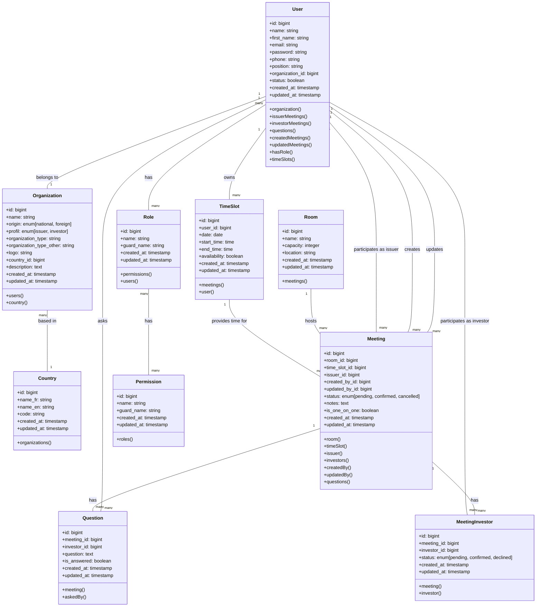

# Diagramme de Classes Principal - Entités Métier

## Description

Ce diagramme présente les principales entités métier du système BMCE Invest et leurs relations directes. Il couvre la gestion des utilisateurs, organisations, rendez-vous et le système de permissions de base. Ce diagramme constitue le cœur fonctionnel de l'application et montre les interactions essentielles entre les différents composants du domaine métier.

