# Diagramme de Séquence - Export de Données

## Description
Ce diagramme illustre le processus d'export de données vers Excel dans le système BMCE Invest. Il couvre la génération de fichiers Excel pour différents types de données (utilisateurs, organisations, rendez-vous), la gestion des permissions d'export et le téléchargement sécurisé. Le processus inclut également la personnalisation des colonnes et le formatage selon les besoins métier.

```mermaid
sequenceDiagram
    participant U as Utilisateur
    participant B as Navigateur
    participant EC as ExportController
    participant PM as PermissionManager
    participant EX as ExcelExporter
    participant UM as UserModel
    participant OM as OrganizationModel
    participant MM as MeetingModel
    participant FS as FileSystem
    participant QM as QueueManager
    participant NS as NotificationService
    participant DB as Base de Données

    Note over U,DB: Export de Données - BMCE Invest

    %% Phase 1: Accès à la page d'export
    U->>B: Accède à la section Export
    B->>EC: GET /admin/exports
    EC->>PM: Vérifie permissions d'export
    PM->>DB: SELECT permissions pour l'utilisateur
    DB->>PM: Permissions utilisateur
    
    alt Pas de permission d'export
        PM->>EC: Accès refusé
        EC->>B: Erreur 403 - Accès interdit
        B->>U: Message "Accès non autorisé"
    else Permission accordée
        EC->>B: Page d'export avec options
        B->>U: Interface de sélection d'export
    end

    %% Phase 2: Sélection du type d'export
    U->>B: Sélectionne type d'export (Users/Organizations/Meetings)
    B->>EC: POST /admin/exports/prepare {type, filters, columns}
    
    %% Phase 3: Validation des paramètres
    EC->>EC: Valide type d'export et filtres
    alt Paramètres invalides
        EC->>B: Erreurs de validation
        B->>U: Affiche erreurs
    else Paramètres valides
        
        %% Phase 4: Estimation de la taille
        EC->>DB: COUNT(*) selon les filtres
        DB->>EC: Nombre d'enregistrements
        
        alt Export volumineux (>10000 enregistrements)
            EC->>QM: Programmation export en arrière-plan
            QM->>QM: Créer job d'export
            EC->>B: "Export programmé, vous recevrez une notification"
            B->>U: Message de confirmation
            
            %% Process en arrière-plan
            rect rgb(240, 248, 255)
                Note over QM,DB: Traitement en arrière-plan
                QM->>EX: Exécute job d'export
                EX->>DB: Query selon les filtres
                
                alt Export Users
                    EX->>UM: Récupère données utilisateurs
                    UM->>DB: SELECT users avec relations (organization, country)
                    DB->>UM: Données utilisateurs complètes
                    UM->>EX: Collection d'utilisateurs
                    EX->>EX: Formate données (nom complet, statut, organisation)
                else Export Organizations
                    EX->>OM: Récupère données organisations
                    OM->>DB: SELECT organizations avec relations (country, users)
                    DB->>OM: Données organisations complètes
                    OM->>EX: Collection d'organisations
                    EX->>EX: Formate données (nom, type, pays, nb utilisateurs)
                else Export Meetings
                    EX->>MM: Récupère données meetings
                    MM->>DB: SELECT meetings avec relations complètes
                    DB->>MM: Données meetings complètes
                    MM->>EX: Collection de meetings
                    EX->>EX: Formate données (date, participants, statut, salle)
                end
                
                EX->>EX: Génère fichier Excel avec formatage
                EX->>FS: Sauvegarde fichier temporaire
                FS->>EX: Chemin du fichier généré
                
                EX->>NS: Notifie utilisateur de la completion
                NS->>U: Notification "Export terminé, fichier prêt"
                NS->>U: Email avec lien de téléchargement
            end
            
        else Export normal (<=10000 enregistrements)
            %% Phase 5: Export direct
            EC->>DB: Query selon les filtres et type
            
            alt Export Users
                EC->>UM: Export direct utilisateurs
                UM->>DB: SELECT users WHERE {filters} WITH organization, country
                DB->>UM: Données utilisateurs filtrées
                UM->>EX: Données à exporter
                
                EX->>EX: Créer feuille Excel "Utilisateurs"
                EX->>EX: Headers: Nom, Prénom, Email, Organisation, Pays, Statut, Position
                loop Pour chaque utilisateur
                    EX->>EX: Ajouter ligne avec formatage conditionnel
                end
                
            else Export Organizations
                EC->>OM: Export direct organisations
                OM->>DB: SELECT organizations WHERE {filters} WITH country, users_count
                DB->>OM: Données organisations filtrées
                OM->>EX: Données à exporter
                
                EX->>EX: Créer feuille Excel "Organisations"
                EX->>EX: Headers: Nom, Type, Profil, Pays, Nb Utilisateurs, Statut
                loop Pour chaque organisation
                    EX->>EX: Ajouter ligne avec formatage
                end
                
            else Export Meetings
                EC->>MM: Export direct meetings
                MM->>DB: SELECT meetings WHERE {filters} WITH ALL relations
                DB->>MM: Données meetings filtrées
                MM->>EX: Données à exporter
                
                EX->>EX: Créer feuille Excel "Rendez-vous"
                EX->>EX: Headers: Date, Heure, Émetteur, Investisseurs, Salle, Statut
                loop Pour chaque meeting
                    EX->>EX: Ajouter ligne avec participants concaténés
                end
            end
            
            %% Phase 6: Génération et formatage du fichier
            EX->>EX: Applique styles (headers en gras, couleurs alternées)
            EX->>EX: Ajuste largeur des colonnes automatiquement
            EX->>EX: Ajoute feuille "Métadonnées" avec infos export
            EX->>EX: Finalise le fichier Excel
            
            %% Phase 7: Téléchargement direct
            EX->>EC: Fichier Excel généré
            EC->>B: Response avec fichier (Content-Disposition: attachment)
            B->>U: Téléchargement automatique du fichier
        end
    end

    Note over U,DB: Gestion des Exports Programmés

    %% Phase 8: Consultation des exports en cours
    U->>B: Accède à "Mes exports"
    B->>EC: GET /admin/exports/history
    EC->>QM: Récupère jobs d'export de l'utilisateur
    QM->>DB: SELECT export_jobs WHERE user_id = ?
    DB->>QM: Liste des exports (en cours, terminés, échoués)
    QM->>EC: Statuts des exports
    EC->>B: Liste avec statuts et liens de téléchargement
    B->>U: Tableau des exports avec actions

    %% Phase 9: Téléchargement d'un export terminé
    U->>B: Clique sur "Télécharger" pour un export terminé
    B->>EC: GET /admin/exports/download/{export_id}
    EC->>PM: Vérifie propriété de l'export
    PM->>DB: SELECT export WHERE id = ? AND user_id = ?
    DB->>PM: Export appartient à l'utilisateur
    
    alt Export non trouvé ou non autorisé
        PM->>EC: Accès refusé
        EC->>B: Erreur 404 ou 403
        B->>U: Message d'erreur
    else Export autorisé
        EC->>FS: Vérifie existence du fichier
        FS->>EC: Fichier existe
        EC->>B: Stream du fichier avec headers appropriés
        B->>U: Téléchargement du fichier
        
        %% Logging de l'activité
        EC->>DB: LOG download activity
    end

    Note over U,DB: Exports Personnalisés et Filtres Avancés

    %% Phase 10: Export avec filtres avancés
    rect rgb(240, 255, 240)
        U->>B: Applique filtres avancés (dates, statuts, organisations)
        B->>EC: POST /admin/exports/custom {filters: {...}, columns: [...]}
        
        EC->>EC: Construit query dynamique selon filtres
        alt Filtre par dates
            EC->>EC: WHERE created_at BETWEEN ? AND ?
        end
        alt Filtre par organisation
            EC->>EC: WHERE organization_id IN (?)
        end
        alt Filtre par statut
            EC->>EC: WHERE status = ?
        end
        
        EC->>DB: Exécute query complexe avec filtres
        DB->>EC: Résultats filtrés
        EC->>EX: Génère export avec colonnes sélectionnées uniquement
        EX->>EC: Fichier personnalisé
        EC->>B: Téléchargement du fichier personnalisé
        B->>U: Fichier avec données filtrées
    end

    Note over U,DB: Gestion des Erreurs

    %% Gestion d'erreurs système
    rect rgb(255, 240, 240)
        alt Erreur lors de la génération
            EX->>QM: Erreur de génération
            QM->>NS: Notifie échec de l'export
            NS->>U: Notification "Échec de l'export"
            QM->>DB: UPDATE export_jobs SET status = 'failed'
        end
        
        alt Fichier trop volumineux
            EX->>EC: Limite de taille dépassée
            EC->>B: Erreur "Export trop volumineux"
            B->>U: Suggestion de filtrer les données
        end
        
        alt Timeout lors du traitement
            QM->>QM: Job timeout
            QM->>NS: Notifie timeout
            NS->>U: "Export en cours, veuillez patienter"
            QM->>QM: Relance automatique du job
        end
    end
```

