# Diagramme de Séquence - Création de Rendez-vous

## Description
Ce diagramme détaille le processus complet de création d'un rendez-vous entre un émetteur et des investisseurs. Il couvre la sélection des créneaux horaires, la validation des disponibilités, l'invitation des investisseurs et les notifications. Le processus inclut également la gestion des conflits de planning et la confirmation des participants.

```mermaid
sequenceDiagram
    participant I as Issuer
    participant B as Navigateur
    participant MC as MeetingController
    participant TSM as TimeSlotModel
    participant UM as UserModel
    participant MM as MeetingModel
    participant MIM as MeetingInvestorModel
    participant RM as RoomModel
    participant MS as MailService
    participant NS as NotificationService
    participant DB as Base de Données

    Note over I,DB: Création d'un Rendez-vous - BMCE Invest

    %% Phase 1: Accès à la page de création
    I->>B: Accède à "Créer un rendez-vous"
    B->>MC: GET /meetings/create
    MC->>TSM: Récupère créneaux disponibles de l'issuer
    TSM->>DB: SELECT * FROM time_slots WHERE user_id = ? AND availability = true
    DB->>TSM: Liste des créneaux disponibles
    MC->>RM: Récupère salles disponibles
    RM->>DB: SELECT * FROM rooms WHERE is_active = true
    DB->>RM: Liste des salles
    MC->>UM: Récupère investisseurs potentiels
    UM->>DB: SELECT users WHERE organization.profil = 'investor'
    DB->>UM: Liste des investisseurs
    MC->>B: Formulaire avec données
    B->>I: Affiche formulaire de création

    %% Phase 2: Sélection et validation
    I->>B: Sélectionne créneau, salle et investisseurs
    B->>MC: POST /meetings {time_slot_id, room_id, investor_ids, notes}
    
    %% Phase 3: Validations préliminaires
    MC->>MC: Valide données requises
    alt Données invalides
        MC->>B: Erreurs de validation
        B->>I: Affiche erreurs
    else Données valides
        
        %% Phase 4: Vérification des disponibilités
        MC->>TSM: Vérifie disponibilité du créneau
        TSM->>DB: SELECT * FROM time_slots WHERE id = ? AND availability = true
        DB->>TSM: Créneau disponible ou non
        
        alt Créneau non disponible
            TSM->>MC: Créneau indisponible
            MC->>B: Erreur "Créneau non disponible"
            B->>I: Affiche erreur
        else Créneau disponible
            
            %% Phase 5: Vérification de la salle
            MC->>RM: Vérifie disponibilité de la salle
            RM->>DB: SELECT meetings WHERE room_id = ? AND time_slot_id = ?
            DB->>RM: Conflits potentiels
            
            alt Salle occupée
                RM->>MC: Salle non disponible
                MC->>B: Erreur "Salle occupée"
                B->>I: Affiche erreur avec alternatives
            else Salle disponible
                
                %% Phase 6: Vérification des investisseurs
                MC->>UM: Vérifie existence et statut des investisseurs
                UM->>DB: SELECT * FROM users WHERE id IN (?) AND status = true
                DB->>UM: Investisseurs valides
                
                %% Phase 7: Vérification des conflits d'horaires investisseurs
                loop Pour chaque investisseur
                    MC->>MIM: Vérifie conflits horaires
                    MIM->>DB: SELECT meetings WHERE investor_id = ? AND time_slot_id = ?
                    DB->>MIM: Conflits existants
                    alt Conflit détecté
                        MIM->>MC: Investisseur non disponible
                        MC->>MC: Ajoute à la liste des conflits
                    end
                end
                
                alt Conflits d'horaires détectés
                    MC->>B: Liste des investisseurs en conflit
                    B->>I: Demande confirmation pour continuer
                    I->>B: Confirme ou annule
                    alt Annulation
                        B->>MC: Annulation création
                        MC->>B: Retour au formulaire
                        B->>I: Formulaire avec ajustements
                    end
                end
                
                %% Phase 8: Transaction de création
                MC->>DB: BEGIN TRANSACTION
                
                %% Création du meeting
                MC->>MM: Créer nouveau meeting
                MM->>DB: INSERT INTO meetings (room_id, time_slot_id, issuer_id, created_by_id, status, notes)
                DB->>MM: meeting_id généré
                
                %% Association des investisseurs
                loop Pour chaque investisseur
                    MC->>MIM: Créer relation meeting-investisseur
                    MIM->>DB: INSERT INTO meeting_investors (meeting_id, investor_id, status = 'pending')
                    DB->>MIM: Relation créée
                end
                
                %% Mise à jour du créneau (optionnel selon la logique métier)
                MC->>TSM: Marquer créneau comme utilisé (si exclusif)
                TSM->>DB: UPDATE time_slots SET availability = false WHERE id = ?
                
                MC->>DB: COMMIT TRANSACTION
                
                %% Phase 9: Notifications et confirmations
                MC->>NS: Préparer notifications
                
                %% Notification à l'issuer
                NS->>I: Notification "Rendez-vous créé avec succès"
                
                %% Notifications aux investisseurs
                loop Pour chaque investisseur
                    NS->>MS: Envoyer email d'invitation
                    MS->>MS: Préparer template email avec détails meeting
                    MS->>UM: Email envoyé à l'investisseur
                    NS->>UM: Notification in-app "Nouvelle invitation à un rendez-vous"
                end
                
                %% Phase 10: Génération de liens et QR codes
                MC->>MC: Générer lien de meeting (si virtuel)
                MC->>MC: Générer QR code pour accès rapide
                MC->>DB: UPDATE meetings SET meeting_link = ?, qr_code = ?
                
                %% Phase 11: Réponse finale
                MC->>B: Redirection vers détails du meeting
                B->>I: Page de confirmation avec détails
            end
        end
    end

    Note over I,DB: Gestion des Réponses des Investisseurs

    %% Phase 12: Réponse d'un investisseur
    rect rgb(240, 255, 240)
        participant Inv as Investisseur
        Inv->>B: Clique sur lien dans email/notification
        B->>MC: GET /meetings/{id}/respond
        MC->>MM: Vérifie existence et droits d'accès
        MM->>DB: SELECT meeting avec détails
        DB->>MM: Données du meeting
        MC->>B: Page de réponse à l'invitation
        B->>Inv: Formulaire de réponse (Accepter/Refuser)
        
        Inv->>B: Soumet réponse (accept/decline)
        B->>MC: POST /meetings/{id}/respond {status}
        MC->>MIM: Met à jour statut de participation
        MIM->>DB: UPDATE meeting_investors SET status = ? WHERE meeting_id = ? AND investor_id = ?
        DB->>MIM: Statut mis à jour
        
        %% Notification à l'issuer
        MC->>NS: Notifier l'issuer de la réponse
        NS->>MS: Email à l'issuer "Réponse reçue"
        NS->>I: Notification "Un investisseur a répondu"
        
        MC->>B: Confirmation de réponse
        B->>Inv: "Votre réponse a été enregistrée"
    end

    Note over I,DB: Gestion des Erreurs et Cas Particuliers

    %% Gestion d'erreur système
    rect rgb(255, 240, 240)
        alt Erreur base de données pendant transaction
            DB->>MC: Erreur SQL
            MC->>DB: ROLLBACK TRANSACTION
            MC->>B: Erreur "Problème technique, veuillez réessayer"
            B->>I: Message d'erreur avec option de réessayer
        end
        
        alt Service email indisponible
            MS->>MC: Erreur envoi email
            MC->>MC: Marquer emails comme "à renvoyer"
            MC->>NS: Notification différée programmée
            MC->>B: Meeting créé mais "emails en cours d'envoi"
            B->>I: Confirmation avec note sur les notifications
        end
    end
```

