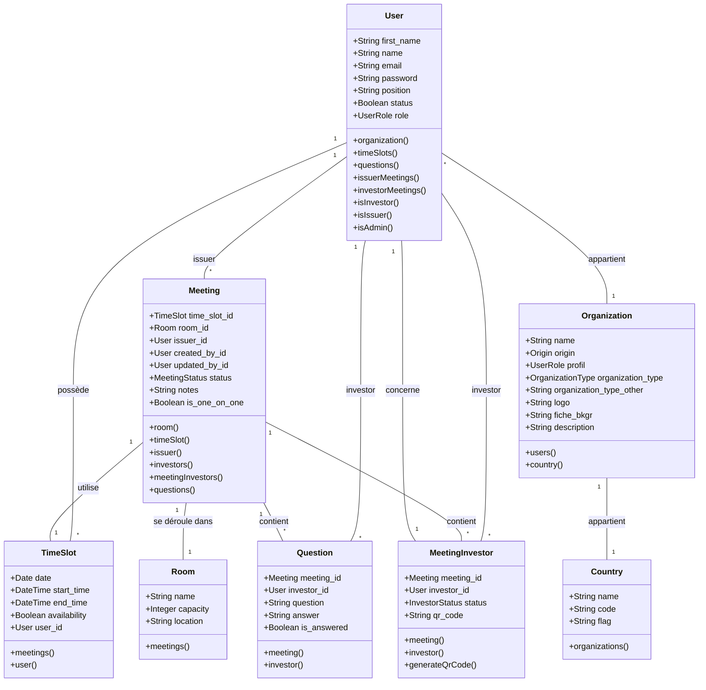
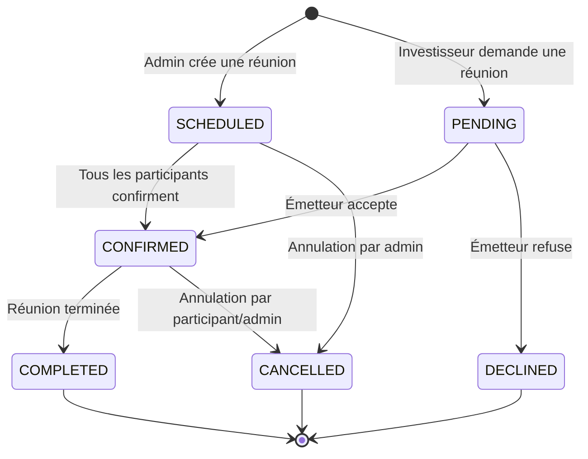

# Documentation du projet BMCE Capital Investors Conference 2025


## Table des matières

1. [Présentation du projet](#presentation-du-projet)
2. [Guide d'installation](#guide-dinstallation)
   - [Pré-requis](#pre-requis)
   - [Installation avec Laravel Sail](#installation-avec-laravel-sail)
   - [Installation traditionnelle](#installation-traditionnelle)
   - [Commandes utiles](#commandes-utiles)
3. [Structure du projet](#structure-du-projet)
4. [Modèles et relations](#modeles-et-relations)
   - [Diagramme de classes](#diagramme-de-classes)
   - [Description des entités](#description-des-entites)
5. [Workflow de la plateforme](#workflow-de-la-plateforme)
   - [Cycle de vie d'une réunion](#cycle-de-vie-dune-reunion)
   - [Processus pour les investisseurs](#processus-pour-les-investisseurs)
   - [Processus pour les émetteurs](#processus-pour-les-emetteurs)
   - [Processus pour les administrateurs](#processus-pour-les-administrateurs)
6. [Règles de gestion](#regles-de-gestion)
7. [Interfaces utilisateur](#interfaces-utilisateur)
8. [Support et maintenance](#support-et-maintenance)

<a id="presentation-du-projet"></a>
## 1. Présentation du projet

La plateforme **BMCE Capital Investors Conference 2025** est une application web développée pour faciliter la planification et la gestion des réunions entre investisseurs institutionnels et sociétés cotées (émetteurs) lors de la conférence annuelle des investisseurs de BMCE Capital prévue les 12-13 juin 2025 à Casablanca, Maroc.

### Objectifs de la plateforme

- Digitaliser entièrement le processus de planification des rendez-vous
- Faciliter la mise en relation entre investisseurs et émetteurs
- Optimiser la gestion des créneaux horaires et des salles de réunion
- Centraliser les informations et les échanges préalables
- Offrir des tableaux de bord pour le suivi en temps réel
- Générer des rapports et statistiques pour l'organisation

### Fonctionnalités principales

- Système d'authentification et de gestion des utilisateurs multi-rôles
- Gestion des créneaux horaires par les émetteurs
- Demande de réunions par les investisseurs
- Planification automatique et manuelle des réunions
- Système de questions/réponses préalables aux réunions
- Gestion des salles et des ressources
- Tableaux de bord et rapports statistiques
- Génération de QR codes pour l'accès aux réunions
- Export de données au format Excel et PDF

<a id="guide-dinstallation"></a>
## 2. Guide d'installation

<a id="pre-requis"></a>
### Pré-requis

- PHP 8.2 ou supérieur
- Composer
- Node.js et npm
- MySQL ou PostgreSQL
- Git

<a id="installation-avec-laravel-sail"></a>
### Installation avec Laravel Sail (recommandé pour le développement)

Laravel Sail est un environnement de développement léger basé sur Docker qui offre un excellent point de départ pour construire une application Laravel avec PHP, MySQL et Redis. Il ne nécessite que Docker et est idéal pour les développeurs travaillant sur Mac, Windows ou Linux.

1. Cloner le dépôt du projet :
```powershell
git clone https://github.com/votre-organisation/bmce-invest-2025.git
cd bmce-invest-2025
```

2. Installer les dépendances PHP via un conteneur Docker temporaire :
```powershell
docker run --rm -v "${PWD}:/var/www/html" -w "/var/www/html" composer install --ignore-platform-reqs
```

3. Configurer le fichier d'environnement :
```powershell
cp .env.example .env
```

4. Démarrer l'environnement Laravel Sail :
```powershell
./vendor/bin/sail up -d
```
> Note: Sur Windows PowerShell, utilisez `.\vendor\bin\sail up -d`

5. Générer la clé d'application et exécuter les migrations :
```powershell
./vendor/bin/sail artisan key:generate
./vendor/bin/sail artisan migrate --seed
```

6. Installer les dépendances front-end et compiler les assets :
```powershell
./vendor/bin/sail npm install
./vendor/bin/sail npm run build
```

7. Accéder à l'application à l'adresse http://localhost

<a id="installation-traditionnelle"></a>
### Installation traditionnelle

1. Cloner le dépôt du projet :
```powershell
git clone https://github.com/votre-organisation/bmce-invest-2025.git
cd bmce-invest-2025
```

2. Installer les dépendances PHP :
```powershell
composer install
```

3. Configurer le fichier d'environnement :
```powershell
cp .env.example .env
```

4. Configurer votre base de données dans le fichier `.env`

5. Générer la clé d'application et exécuter les migrations :
```powershell
php artisan key:generate
php artisan migrate --seed
```

6. Installer les dépendances front-end et compiler les assets :
```powershell
npm install
npm run build
```

7. Démarrer le serveur de développement :
```powershell
php artisan serve
```

8. Accéder à l'application à l'adresse http://localhost:8000

<a id="commandes-utiles"></a>
### Commandes utiles

#### Commandes Laravel
```powershell
# Commandes avec Laravel Sail
./vendor/bin/sail artisan migrate:fresh --seed        # Réinitialiser la base de données et exécuter les seeders
./vendor/bin/sail artisan route:list                  # Lister toutes les routes
./vendor/bin/sail artisan make:controller NomController # Créer un contrôleur
./vendor/bin/sail artisan make:model Nom -mfs         # Créer un modèle avec migration, factory et seeder
./vendor/bin/sail test                                # Exécuter les tests

# Commandes sans Sail (remplacer ./vendor/bin/sail par php)
php artisan cache:clear                              # Vider le cache de l'application
php artisan config:clear                             # Vider le cache de configuration
php artisan queue:work                               # Démarrer le worker de files d'attente
```

#### Commandes NPM
```powershell
npm run dev                                          # Démarrer le serveur de développement Vite
npm run build                                        # Compiler les assets pour la production
```

#### Autres commandes utiles
```powershell
# À exécuter avec Sail
./vendor/bin/sail composer require package-name      # Ajouter un package PHP
./vendor/bin/sail npm install package-name           # Ajouter un package npm
./vendor/bin/sail php artisan vendor:publish         # Publier les ressources des packages

# Débogage
./vendor/bin/sail artisan route:clear                # Vider le cache des routes
./vendor/bin/sail artisan view:clear                 # Vider le cache des vues
```

<a id="structure-du-projet"></a>
## 3. Structure du projet

Le projet suit l'architecture standard de Laravel, avec quelques répertoires supplémentaires pour organiser les fonctionnalités spécifiques à l'application.

### Structure des répertoires

```
bmce-invest-2025/
├── app/                      # Cœur de l'application
│   ├── Console/              # Commandes artisan personnalisées
│   ├── Enums/                # Énumérations PHP 8.1+ (roles, statuts, types)
│   ├── Exceptions/           # Gestionnaires d'exceptions personnalisés
│   ├── Exports/              # Classes pour l'export de données (Excel, PDF)
│   ├── Http/                 # Contrôleurs, middleware, requests
│   ├── Imports/              # Classes pour l'import de données
│   ├── Livewire/             # Composants Livewire (interactivité temps réel)
│   ├── Mail/                 # Classes pour l'envoi d'emails
│   ├── Models/               # Modèles Eloquent (entités de la BDD)
│   ├── Observers/            # Observateurs pour les modèles
│   ├── Providers/            # Service providers
│   ├── Services/             # Services métier
│   └── View/                 # Composants de vue
├── bootstrap/                # Fichiers d'initialisation
├── config/                   # Configuration de l'application
├── database/                 # Migrations, seeders et factories
│   ├── diagrams/             # Schémas de base de données
│   ├── factories/            # Factories pour les tests
│   ├── migrations/           # Migrations de la base de données
│   └── seeders/              # Seeders pour peupler la BDD
├── docs/                     # Documentation du projet
├── lang/                     # Traductions (français et anglais)
├── public/                   # Fichiers publics
│   ├── build/                # Assets compilés (JS/CSS)
│   └── img/                  # Images publiques
├── resources/                # Ressources frontend non compilées
│   ├── css/                  # Feuilles de style
│   ├── js/                   # Scripts JavaScript
│   ├── scss/                 # Fichiers SCSS
│   └── views/                # Vues Blade
│       ├── admin/            # Vues pour le back-office admin
│       ├── investor/         # Vues pour les investisseurs
│       ├── issuer/           # Vues pour les émetteurs
│       └── ...
├── routes/                   # Définition des routes
├── storage/                  # Fichiers générés par l'application
├── temp_excel_files/         # Modèles d'import Excel
├── tests/                    # Tests automatisés
└── vendor/                   # Dépendances (via Composer)
```

### Architecture logicielle

L'application suit principalement le pattern MVC (Modèle-Vue-Contrôleur) avec des éléments additionnels :

- **Modèles** : Représentent les entités métier et les relations entre elles (app/Models)
- **Vues** : Templates Blade pour le rendu HTML (resources/views)
- **Contrôleurs** : Orchestrent les requêtes et les réponses (app/Http/Controllers)
- **Services** : Encapsulent la logique métier complexe (app/Services)
- **Enum** : Utilisent les énumérations PHP 8.1+ pour les types et statuts (app/Enums)
- **Livewire** : Composants dynamiques côté serveur (app/Livewire)

<a id="modeles-et-relations"></a>
## 4. Modèles et relations

<a id="diagramme-de-classes"></a>
### Diagramme de classes



<a id="description-des-entites"></a>
### Description des entités

#### User (Utilisateur)
Représente tous les utilisateurs de la plateforme.

**Attributs principaux :**
- `first_name` : Prénom de l'utilisateur
- `name` : Nom de l'utilisateur
- `email` : Adresse email (utilisée pour l'authentification)
- `password` : Mot de passe (hashé)
- `position` : Poste/fonction de l'utilisateur
- `organization_id` : Organisation à laquelle appartient l'utilisateur
- `status` : État du compte (actif/inactif)

**Relations :**
- Appartient à une `Organization`
- Possède plusieurs `TimeSlot` (pour les émetteurs)
- Peut avoir plusieurs `Meeting` en tant qu'émetteur
- Peut participer à plusieurs `Meeting` en tant qu'investisseur (via `MeetingInvestor`)
- Peut poser plusieurs `Question`

**Rôles :**
- `ADMIN` : Administrateur de la plateforme
- `INVESTOR` : Investisseur (demande des rendez-vous)
- `ISSUER` : Émetteur (accepte des rendez-vous)

#### Organization (Organisation)
Représente les institutions (émetteurs ou investisseurs).

**Attributs principaux :**
- `name` : Nom de l'organisation
- `origin` : Origine (nationale/étrangère)
- `profil` : Profil (émetteur/investisseur)
- `organization_type` : Type d'organisation (banque, assurance, etc.)
- `logo` : Chemin vers le logo
- `country_id` : Pays d'origine
- `description` : Description de l'organisation

**Relations :**
- Possède plusieurs `User`
- Appartient à un `Country`

**Types d'organisations :**
- `CAISSE_RETRAITE` : Caisse de retraite
- `OPCVM` : OPCVM
- `ASSURANCE` : Compagnie d'assurance
- `GESTION_SOUS_MANDAT` : Gestion sous mandat
- `BANQUE` : Banque
- `FONDS_INVESTISSEMENT` : Fonds d'investissement
- `AUTRE` : Autre type

#### Meeting (Réunion)
Entité centrale qui représente une réunion entre émetteurs et investisseurs.

**Attributs principaux :**
- `time_slot_id` : Créneau horaire de la réunion
- `room_id` : Salle où se déroule la réunion
- `issuer_id` : Émetteur participant à la réunion
- `status` : Statut de la réunion
- `notes` : Notes concernant la réunion
- `is_one_on_one` : Indique si c'est une réunion individuelle (vs. groupe)

**Relations :**
- Associée à un `TimeSlot`
- Se déroule dans une `Room`
- A un `User` comme émetteur
- Implique plusieurs investisseurs via `MeetingInvestor`
- Peut avoir plusieurs `Question`

**Statuts possibles :**
- `SCHEDULED` : Programmée
- `PENDING` : En attente de confirmation
- `CONFIRMED` : Confirmée
- `CANCELLED` : Annulée
- `COMPLETED` : Terminée
- `DECLINED` : Refusée

#### TimeSlot (Créneau horaire)
Représente un créneau horaire disponible pour les réunions.

**Attributs principaux :**
- `date` : Date du créneau
- `start_time` : Heure de début
- `end_time` : Heure de fin
- `availability` : Disponibilité du créneau
- `user_id` : Émetteur associé au créneau

**Relations :**
- Appartient à un `User` (émetteur)
- Peut être utilisé pour plusieurs `Meeting`

#### MeetingInvestor (Pivot Réunion-Investisseur)
Table pivot qui gère la relation many-to-many entre réunions et investisseurs.

**Attributs principaux :**
- `meeting_id` : ID de la réunion
- `investor_id` : ID de l'investisseur
- `status` : Statut de participation de l'investisseur
- `qr_code` : Code QR généré pour l'accès

**Relations :**
- Relie un `Meeting` à un `User` (investisseur)

**Statuts possibles :**
- `PENDING` : En attente de confirmation
- `CONFIRMED` : Participation confirmée
- `CANCELLED` : Participation annulée
- `DECLINED` : Participation refusée

#### Question (Question)
Représente une question posée par un investisseur avant une réunion.

**Attributs principaux :**
- `meeting_id` : Réunion concernée
- `investor_id` : Investisseur ayant posé la question
- `question` : Texte de la question
- `answer` : Réponse à la question
- `is_answered` : Indique si la question a été répondue

**Relations :**
- Appartient à un `Meeting`
- Posée par un `User` (investisseur)

#### Room (Salle)
Représente une salle physique où se déroulent les réunions.

**Attributs principaux :**
- `name` : Nom de la salle
- `capacity` : Capacité (nombre de personnes)
- `location` : Emplacement/description

**Relations :**
- Peut accueillir plusieurs `Meeting`

#### Country (Pays)
Représente un pays d'origine pour les organisations.

**Attributs principaux :**
- `name` : Nom du pays
- `code` : Code ISO du pays
- `flag` : Drapeau du pays (chemin vers l'image)

**Relations :**
- Peut être l'origine de plusieurs `Organization`

<a id="workflow-de-la-plateforme"></a>
## 5. Workflow de la plateforme

<a id="cycle-de-vie-dune-reunion"></a>
### Cycle de vie d'une réunion



<a id="processus-pour-les-investisseurs"></a>
### Processus pour les investisseurs

1. **Connexion et exploration**
   - L'investisseur se connecte à la plateforme
   - Il parcourt la liste des émetteurs disponibles
   - Il consulte les profils et les créneaux disponibles

2. **Demande de réunion**
   - Il sélectionne un émetteur et un créneau disponible
   - Il remplit un formulaire de demande de réunion
   - Il peut ajouter des questions préliminaires
   - La demande est envoyée avec le statut "PENDING"

3. **Suivi des demandes**
   - Il consulte son tableau de bord pour suivre l'état de ses demandes
   - Il reçoit des notifications par email lors des changements de statut
   - Il peut annuler ses demandes en attente

4. **Participation aux réunions**
   - Il reçoit un QR code pour chaque réunion confirmée
   - Il peut consulter son agenda personnel pour la conférence
   - Il utilise le QR code pour accéder à la salle de réunion

<a id="processus-pour-les-emetteurs"></a>
### Processus pour les émetteurs

1. **Configuration des disponibilités**
   - L'émetteur se connecte à la plateforme
   - Il définit ses créneaux de disponibilité pour la conférence
   - Il peut bloquer certains créneaux pour des pauses

2. **Gestion des demandes**
   - Il reçoit des notifications pour les nouvelles demandes
   - Il consulte les détails des investisseurs demandeurs
   - Il peut accepter ou refuser chaque demande
   - Il peut proposer un créneau alternatif

3. **Préparation des réunions**
   - Il répond aux questions préliminaires des investisseurs
   - Il consulte son agenda personnel pour la conférence
   - Il peut ajouter des notes pour chaque réunion

4. **Suivi post-réunion**
   - Il peut marquer les réunions comme complétées
   - Il peut ajouter des notes post-réunion
   - Il a accès aux statistiques de ses réunions

<a id="processus-pour-les-administrateurs"></a>
### Processus pour les administrateurs

1. **Configuration de la plateforme**
   - Création des comptes utilisateurs
   - Configuration des salles de réunion
   - Paramétrage des plages horaires globales

2. **Gestion des utilisateurs**
   - Import/export des utilisateurs et organisations
   - Activation/désactivation des comptes
   - Gestion des rôles et permissions

3. **Supervision des réunions**
   - Création manuelle de réunions
   - Résolution des conflits de planification
   - Suivi global des réunions et statistiques

4. **Reporting**
   - Génération de rapports sur les réunions
   - Statistiques de participation
   - Export des données pour analyse

<a id="regles-de-gestion"></a>
## 6. Règles de gestion

### Règles générales

1. **Authentification et accès**
   - Chaque utilisateur doit avoir un compte avec email et mot de passe
   - Les accès sont strictement contrôlés selon le rôle de l'utilisateur
   - Un utilisateur ne peut avoir qu'un seul rôle (Admin, Issuer ou Investor)
   - Un utilisateur est obligatoirement rattaché à une organisation

2. **Gestion des organisations**
   - Une organisation a un type spécifique (émetteur ou investisseur)
   - Une organisation est rattachée à un pays d'origine
   - Le logo de l'organisation est optionnel mais recommandé

### Règles liées aux créneaux et réunions

1. **Créneaux horaires**
   - Les créneaux ont une durée fixe de 45 minutes
   - Un émetteur peut définir sa disponibilité par créneau
   - Un créneau peut être marqué comme non disponible
   - Les créneaux sont spécifiques à chaque émetteur

2. **Réunions**
   - Une réunion implique exactement un émetteur
   - Une réunion peut impliquer un ou plusieurs investisseurs
   - Une réunion est associée à exactement un créneau et une salle
   - Deux réunions ne peuvent pas utiliser la même salle au même créneau
   - Un émetteur ne peut pas avoir deux réunions sur le même créneau

3. **Processus de demande**
   - Un investisseur ne peut demander une réunion que sur un créneau marqué disponible
   - L'émetteur doit explicitement accepter ou refuser chaque demande
   - Une demande sans réponse reste en statut "PENDING"
   - Une réunion confirmée génère automatiquement un QR code d'accès

4. **Annulations et modifications**
   - Une réunion peut être annulée par l'émetteur ou l'administrateur
   - Un investisseur peut annuler sa participation jusqu'à 24h avant
   - Les modifications de créneau nécessitent une nouvelle confirmation

### Règles liées aux questions

1. **Soumission des questions**
   - Un investisseur peut soumettre des questions lors de la demande de réunion
   - Les questions supplémentaires sont possibles jusqu'à 48h avant la réunion
   - Chaque question est liée à une réunion spécifique

2. **Réponses aux questions**
   - L'émetteur doit répondre aux questions avant la réunion
   - Les réponses sont visibles uniquement par l'investisseur concerné
   - Les questions sans réponse sont marquées comme "non répondues"

### Règles d'administration

1. **Gestion des salles**
   - Chaque salle a une capacité maximale
   - La capacité de la salle doit être supérieure ou égale au nombre de participants
   - Les salles sont assignées automatiquement ou manuellement par l'administrateur

2. **Rapports et statistiques**
   - Les administrateurs ont accès à toutes les statistiques de l'événement
   - Les exportations peuvent être générées au format Excel ou PDF
   - Les QR codes peuvent être exportés pour impression

<a id="interfaces-utilisateur"></a>
## 7. Interfaces utilisateur

La plateforme comprend trois interfaces principales, adaptées aux besoins spécifiques de chaque type d'utilisateur :

### Interface Administrateur

- **Dashboard principal**
  - Vue d'ensemble de l'événement
  - Statistiques en temps réel
  - Accès rapide aux fonctionnalités principales

- **Gestion des utilisateurs**
  - Liste des utilisateurs avec filtres
  - Création/édition des comptes
  - Import/export en masse

- **Gestion des organisations**
  - Liste des organisations participantes
  - Modification des profils
  - Attribution des logos et descriptions

- **Planification des réunions**
  - Vue calendrier global
  - Création manuelle de réunions
  - Résolution des conflits

- **Gestion des salles**
  - Configuration des salles disponibles
  - Attribution automatique/manuelle

- **Rapports et statistiques**
  - Génération de rapports personnalisés
  - Export de données

### Interface Émetteur

- **Dashboard émetteur**
  - Agenda personnel
  - Prochaines réunions
  - Demandes en attente

- **Gestion des disponibilités**
  - Calendrier interactif
  - Marquage des créneaux disponibles/indisponibles

- **Gestion des demandes**
  - Liste des demandes entrantes
  - Détails des investisseurs
  - Boutons d'acceptation/refus

- **Questions/réponses**
  - Liste des questions à répondre
  - Interface de réponse
  - Historique des échanges

### Interface Investisseur

- **Dashboard investisseur**
  - Agenda personnel
  - Statut des demandes
  - Émetteurs disponibles

- **Recherche d'émetteurs**
  - Liste filtrée des émetteurs
  - Consultation des profils
  - Visualisation des disponibilités

- **Demande de réunions**
  - Formulaire de demande
  - Soumission de questions
  - Suivi des demandes

- **Mon agenda**
  - Réunions confirmées
  - QR codes d'accès
  - Historique des réunions

<a id="support-et-maintenance"></a>
## 8. Support et maintenance

### Support technique

Pour toute question ou assistance concernant la plateforme, veuillez contacter l'équipe technique :

- **Email** : support@bmce-invest-conference.com
- **Téléphone** : +212 5XX XX XX XX
- **Horaires** : 9h-18h (GMT+1)

### Procédure de signalement des bugs

1. Identifier le problème avec précision
2. Capturer des captures d'écran si possible
3. Noter les étapes pour reproduire le problème
4. Envoyer un rapport détaillé à l'adresse bugs@bmce-invest-conference.com

### Évolutions prévues

La plateforme est en constante évolution. Voici les améliorations prévues pour les versions futures :

1. **Multi-événements** : Support de plusieurs conférences avec dates flexibles
2. **Application mobile** : Version iOS et Android pour accès mobile
3. **Intégration calendrier** : Synchronisation avec Google Calendar et Outlook
4. **Système de chat** : Messagerie en temps réel entre participants
5. **Intelligence artificielle** : Suggestions de réunions basées sur les profils
6. **Vidéoconférence** : Support des réunions virtuelles en plus des réunions physiques

---

© 2025 BMCE Capital Markets | Tous droits réservés
